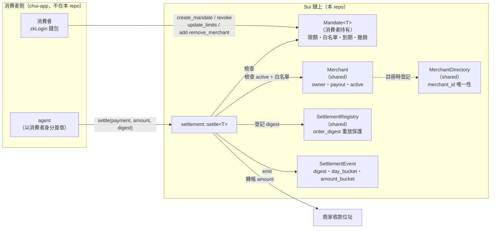

# Chui Protocol（嘴付協議）— 鏈上合約

**Chui Protocol 是 agentic commerce 的支付授權層：消費者在鏈上簽發一份可隨時
撤銷的 Mandate，agent 就能在限額與商家白名單內代為付款，而任何人——包括協定
營運方——都動不了消費者的錢。**

Chui Protocol 是基礎設施，終端使用者永遠不會看到這個名字；
應用層（zkLogin、sponsored transaction、UI）在姊妹 repo `chui-app` 實作。
本 repo 只有 Sui Move 合約、測試、部署腳本與文件。

## Mandate 原語

Mandate 是消費者持有的鏈上物件——不是協定持有、不是 agent 持有，
是**消費者自己錢包裡的一件物品**。它定義：

- **可以花多少**：單筆上限（`per_tx_limit`）與每日上限（`daily_limit`），
  一律以結算幣別的整數最小單位計；每日累計以鏈上時鐘的 UTC 日界歸零。
- **可以付給誰**：merchant_id（32-byte 雜湊）白名單，消費者可隨時增減。
- **何時失效**：到期時間 `expires_at`，以及一鍵不可逆的 `revoke`。

結算（`settle`）必須由消費者身分簽章發起（agent 透過 zkLogin session 以消費者
身分行動；sponsored transaction 只代付 gas）。每一筆結算都要依序通過
撤銷、到期、商家有效、白名單、單筆限額、每日限額、重放保護七道檢查，
全部通過才把錢**直接**轉進商家的收款位址——資金從不經過協定或任何中介帳戶。

## 隱私模型（威脅模型）

**威脅**：結算事件是永久公開的。若事件帶有精確金額與時間戳，觀察者只要
交叉比對，就能還原一個人的消費習慣（金額指紋能對應到特定商品組合）、
作息規律（下單時刻的日內分布）與活動範圍（常用商家的地理分布）。
本協定的事件設計以「斷絕這種還原」為目標，同時保留可稽核性。

觀察者假設：拿得到**全部**鏈上資料——每個物件的內容、每筆交易、每個事件，
並能長期蒐集、離線分析。

**觀察者能推論出什麼**：

- 某個 Mandate（一個不具名的鏈上物件）在某個 UTC 日，對某個 merchant_id
  （一個 32-byte 雜湊）完成過一筆結算。
- 該筆金額落在某個 2 的冪次區間內（`amount_bucket`，例如「介於 4.19 到
  8.39 USDC 之間」），以及一個無法逆推明細的 `order_digest`。
- 消費者位址與其 Mandate 的關聯（物件所有權在 Sui 上公開），
  以及商家收款位址的入帳總量（代幣轉帳本身公開）。

**觀察者不能推論出什麼**：

- **買了什麼**：品項、數量、單價從未上鏈，鏈上只有 digest；
  digest 含 32-byte 隨機 salt，無法對常見商品組合做字典攻擊。
- **精確花了多少**：事件只有對數級距。一杯咖啡與一份簡餐可能落在同一個
  bucket；跨日、跨商家把 bucket 加總也只能得到上下界很寬的估計，
  不足以做金額指紋比對。
- **商家是誰（從 merchant_id 本身）**：merchant_id 是雜湊。
  （注意：商家若公開自己的收款位址或 id，即自行放棄此保護——這是商家的
  選擇，不是協定洩漏。）
- **訂單之間的關聯**：兩個 digest 之間無任何可計算關聯，即使出自同一人
  同一商家的同款訂單（salt 不同、digest 即不同）。

**可稽核性如何保留**：持有訂單明細與 salt 的雙方（消費者、商家）隨時可以
重算 digest、查 `SettlementRegistry` 證明「這份明細已結算」（見
`scripts/verify.ts`）；不持有明細的第三方則什麼都證明不了。爭議時，
出示明細＋salt 即可向仲裁者選擇性揭露單筆訂單，而不暴露其他任何消費紀錄。

**已知殘餘面**：交易時間戳本身公開（結算的存在與時刻無法隱藏——這是
帳本可稽核性的代價）；消費者位址的 gas 使用模式公開；Mandate 的限額欄位
可被讀取（限額是授權參數而非消費紀錄）。應用層可用多 Mandate、
sponsored gas 等手段進一步稀釋，這超出合約層範圍。

## 架構



## Testnet 位址

部署紀錄以 `deployments/testnet.json` 為準（由 `scripts/deploy.sh` 產生），
包含 `packageId`、`settlementRegistryId`、`merchantDirectoryId`、
`upgradeCapId` 與該網路的 `usdcCoinType`。

> **目前狀態**：本套件已完成、測試全綠、部署腳本就緒，但尚未實際發佈——
> 產生本 repo 的工作環境封鎖了對 `fullnode.testnet.sui.io` 的網路連線。
> 在任何能連上 Testnet 的機器執行下述指令即完成部署並自動產生上述檔案：
>
> ```bash
> sui client faucet          # 或 https://faucet.sui.io 領取 Testnet gas
> ./scripts/deploy.sh        # 預設 testnet；mainnet 需要雙重明確旗標
> ```

結算幣別（Testnet 使用 Circle 測試用 USDC）：

| 網路 | USDC coin type |
|---|---|
| Testnet | `0xa1ec7fc00a6f40db9693ad1415d0c193ad3906494428cf252621037bd7117e29::usdc::USDC` |
| Mainnet（尚未部署） | `0xdba34672e30cb065b1f93e3ab55318768fd6fef66c15942c9f7cb846e2f900e7::usdc::USDC` |

幣別是設定值：合約對幣別完全泛型（`Mandate<T>` / `settle<T>`），
chui-app 一律從 `deployments/<network>.json` 讀 `usdcCoinType`，
切換網路不改任何合約邏輯。

## 給 chui-app 的介接快速上手

以下以 `@mysten/sui` TypeScript SDK 為例。先讀部署設定：

```ts
import deployment from "chui-contracts/deployments/testnet.json";
const { packageId, settlementRegistryId, merchantDirectoryId, usdcCoinType } = deployment;
```

**1. 建立 Mandate（消費者簽章；zkLogin + sponsored tx 皆可）**

```ts
import { bcs } from "@mysten/sui/bcs";

const tx = new Transaction();
tx.moveCall({
  target: `${packageId}::mandate::create_mandate`,
  typeArguments: [usdcCoinType],
  arguments: [
    tx.pure.u64(50_000_000n),            // 單筆上限：50 USDC（6 位小數最小單位）
    tx.pure.u64(200_000_000n),           // 每日上限：200 USDC
    tx.pure(                             // 32-byte 商家雜湊白名單
      bcs.vector(bcs.vector(bcs.u8())).serialize([Array.from(merchantIdHash)]),
    ),
    tx.pure.u64(Date.now() + 30 * 86_400_000), // 30 天後到期（epoch 毫秒）
  ],
});
```

**2. 結算（agent 以消費者身分簽章）**

```ts
// order_digest = SHA-256(salt || canonicalJson)——與 scripts/verify.ts 同款演算法
const tx = new Transaction();
tx.moveCall({
  target: `${packageId}::settlement::settle`,
  typeArguments: [usdcCoinType],
  arguments: [
    tx.object(settlementRegistryId),
    tx.object(mandateId),                // 消費者持有的 Mandate
    tx.object(merchantObjectId),         // shared Merchant
    tx.object(usdcCoinId),               // 消費者的 USDC Coin（可大於 amount，自動找零）
    tx.pure.u64(amount),
    tx.pure(bcs.vector(bcs.u8()).serialize(Array.from(orderDigest))),
    tx.object("0x6"),                    // Clock
  ],
});
```

**3. 撤銷（消費者的緊急煞車，一鍵不可逆）**

```ts
tx.moveCall({
  target: `${packageId}::mandate::revoke`,
  typeArguments: [usdcCoinType],
  arguments: [tx.object(mandateId)],
});
```

**4. 監聽結算事件**：訂閱 `${packageId}::settlement::SettlementEvent`；
撤銷偵測訂閱 `${packageId}::mandate::MandateRevokedEvent`，
agent 收到後應立即停止對該 Mandate 發起結算。

**5. 驗證一筆訂單已結算**：

```bash
node --experimental-strip-types scripts/verify.ts \
  --order order.json --salt <64位hex> --network testnet
```

錯誤處理對照：`settle` 的 abort code 與檢查順序見 [SPEC.md](./SPEC.md) §2.3；
agent 端至少要能辨識 `E_REVOKED`（停止重試）、`E_OVER_DAILY`（次日再試）、
`E_REPLAY`（勿重送同一 digest）。

## 開發

```bash
sui move build   # 編譯
sui move test    # 47 個單元測試：所有 abort code、換日歸零、重放、邊界
```

其他文件：協定精確規格見 [SPEC.md](./SPEC.md)，
所有設計決策與理由見 [DECISIONS.md](./DECISIONS.md)。
